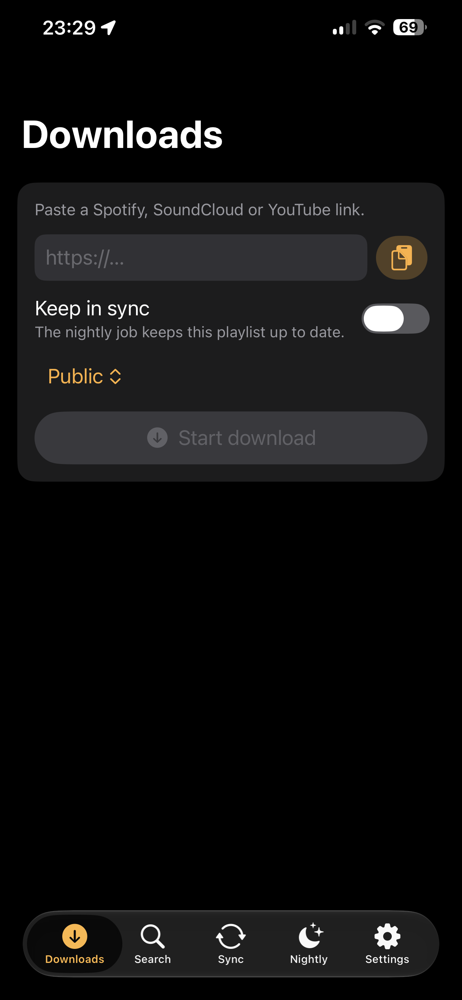
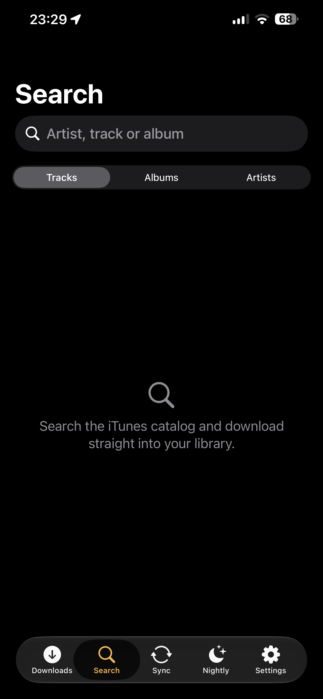
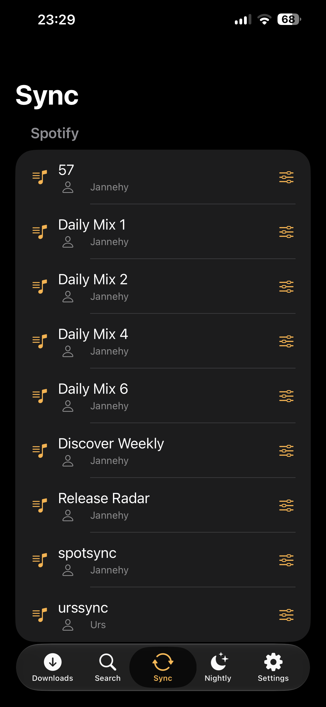
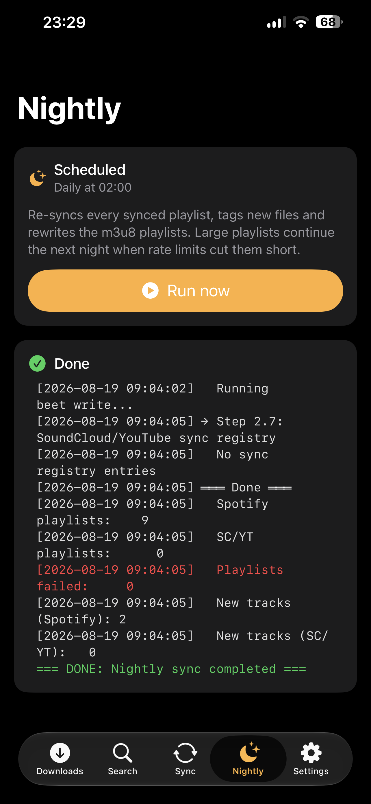

# Nightshift for iOS

A native SwiftUI client for a [Nightshift](https://github.com/Jannehy/nightshift)
server — your self-hosted music library, from your pocket.

<p align="center">
  
  
  
  
</p>

## What it does

| Screen | What you get |
|---|---|
| **Downloads** | Paste a Spotify, SoundCloud or YouTube link, pick a Navidrome owner, mark it for nightly sync, and watch the download live |
| **Search** | The iTunes catalog as an artwork grid with 30-second previews — one tap pulls a track or a whole album into your library |
| **Sync** | Every playlist the nightly job keeps up to date, grouped by source; admins set owner and visibility |
| **Nightly** | The schedule in plain language, a manual run, and its own live log |
| **Settings** | Account and password, user management, the full server configuration, accent colour and app icon |

German and English, following the device language. The accent colour has eight
presets and a free colour picker; the app icon can be switched separately.

## What you need

- An **iPhone or iPad with iOS 16** or newer
- A **Nightshift server** you can reach from the phone — on your home network or
  through a VPN such as Tailscale or WireGuard. Version **1.3 or newer** is
  recommended: from that release the download log is per user, so you no longer
  watch someone else's run.
- An **Apple ID** for signing. Apple does not allow this kind of app in the App
  Store (App Review guideline 5.2.3 rules out downloading media from third-party
  services), so the app is signed with your own account, like any other
  sideloaded app.

## Installing

### AltStore or SideStore (recommended)

Both keep the app up to date and can refresh the signature on their own.

1. Set up [AltStore](https://altstore.io) or [SideStore](https://sidestore.io)
   on your device, following their instructions.
2. In the app: **Browse → Sources → +**
3. Add this source:

   ```
   https://raw.githubusercontent.com/Jannehy/nightshift-ios/main/altstore.json
   ```

4. Open **Nightshift** in the source and tap **Install**.

New versions then show up in AltStore by themselves.

### Sideloadly (no AltStore needed)

1. Download `Nightshift.ipa` from the [latest release](../../releases/latest).
2. Install [Sideloadly](https://sideloadly.io) on a Mac or PC, connect the
   iPhone by cable, drop the IPA in and sign in with your Apple ID.
3. On the iPhone: **Settings → General → VPN & Device Management** and trust the
   developer profile.

### A word on the seven days

With a **free** Apple ID, a sideloaded app stops working after 7 days and has to
be re-signed — AltStore does this by itself while your device and computer are on
the same network. A **paid** Apple Developer account stretches this to a year.
Free accounts are also limited to three sideloaded apps at a time.

## Connecting

On first launch, enter the address of your server:

| Typed | Used |
|---|---|
| `192.168.1.20` | `http://192.168.1.20:8765` |
| `192.168.1.20:9000` | that port instead of the default |
| `nightshift.tail1234.ts.net` | over Tailscale, with the tunnel up |
| `https://music.example.com` | taken as typed, port 443 |

A bare host gets `http://` and Nightshift's default port `8765`; anything more
explicit is used as you typed it, path prefix included.

The app speaks plain HTTP, because that is how Nightshift is normally reached
over a private tunnel or the local network. Behind an HTTPS reverse proxy, enter
the full `https://` URL.

Sign in with your Nightshift account. The session survives restarts, and the
password is kept in the iOS Keychain so the app can sign in again by itself when
the session expires.

## Building from source

Only needed if you want to change something — for installing, use a release.

```bash
brew install xcodegen
xcodegen generate
open Nightshift.xcodeproj
```

Requires **macOS with Xcode 15** or newer. Pick your team under *Signing &
Capabilities* (or put your Team ID into `project.yml` so it survives
regeneration), then build to your device.

`Tools/build-ipa.sh` archives and exports an IPA from the command line;
`Tools/make-altstore-source.py` writes the AltStore source. It reads version and
build number out of the IPA itself — AltStore refuses to install when those
disagree with the source — takes the IPA's exact byte size, and picks up
screenshots from `docs/screenshots/`. Pass `--tag` if the release tag differs
from the app version.

The app mark and the launcher icon come from one place: `Tools/make-icon.py`
rasterises the icon, `--swift` prints the same geometry as constants for the
version drawn inside the app, so the two cannot drift apart.

## Not included

- **Push notifications** when a download finishes — APNs needs a paid developer
  account and a sender on the server side, which Nightshift has no hook for.
- **A share extension** ("Share → Nightshift" from another app). The natural
  next step; it would post the shared URL to `/download`.
- **The setup wizard**, deliberately: on a fresh server the app links you to it
  in Safari, and it is a one-time flow.
- **Cancelling a running job** — the server has no cancel endpoint. "Clear log"
  only detaches the view.

## Licence

[MIT](LICENSE)
